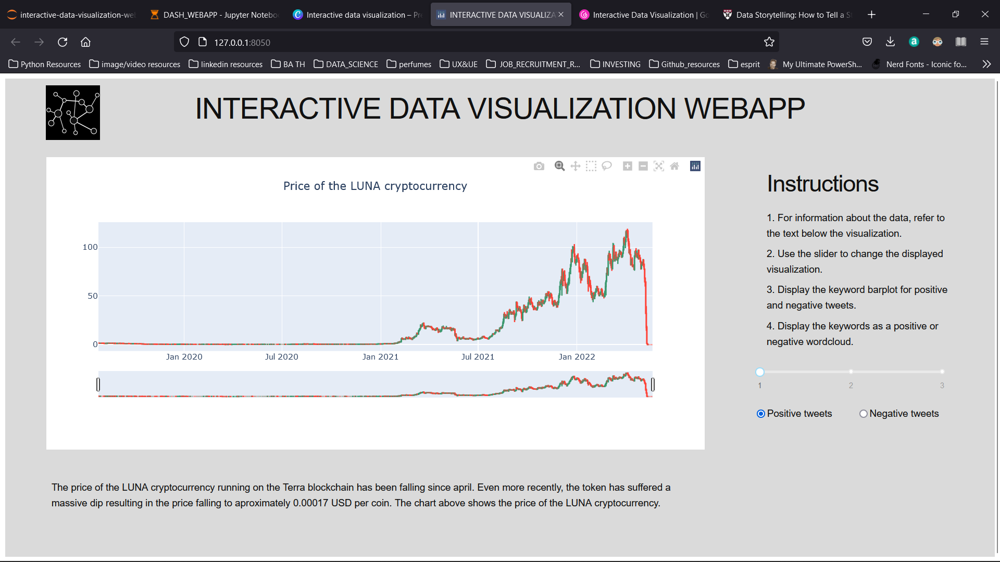

# PROJECT DESCRIPTION

* This is a webapp written with dash created as a project for a Usability Engineering & User experience Design class at the Jagiellonian University (within the Cognitive Science department).
* The main purpose is to expose the user to the beauty of data visualization by letting them interact with the visualizations.

# HOW TO USE THIS PROJECT
* You can run it locally by cloning the repo and running the code in jupyter notebook or jupyter lab
* Make sure you install the dependencies before running the project

# CONTENTS
* twitter_webscraping.ipynb
    * code which scrapes twitter for #LUNA
    * Data exploration
    * Data cleaning
    * Wordcloud plots

## Datasets
* twitter_data is a directory with a file containing 1000 tweets with #LUNA scraped from twitter

# LIBRARIES
* if you want to run this from jupyter notebook or jupyter lab you have to install jupyter-dash https://github.com/plotly/jupyter-dash
* twitter_scraper_selenium https://github.com/shaikhsajid1111/twitter-scraper-selenium
* dash - https://plotly.com/dash/
* plotly - https://plotly.com/
* wordcloud - https://amueller.github.io/word_cloud/
* Pillow - https://pillow.readthedocs.io/en/stable/

# TODO
* enlarge the twitter-luna dataset
* include storytelling elements - "the data should tell a story"
    * include more interaction options
    * include more different plots
* create / scrape other datasets

# AUTHORS
* Agata Serafin - graphical & content design
* Roman Nowak - implementation